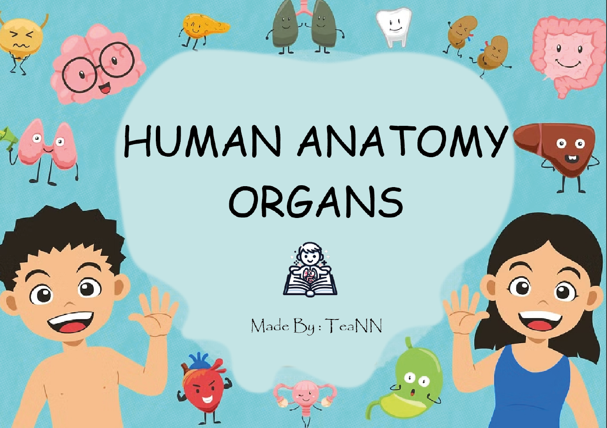
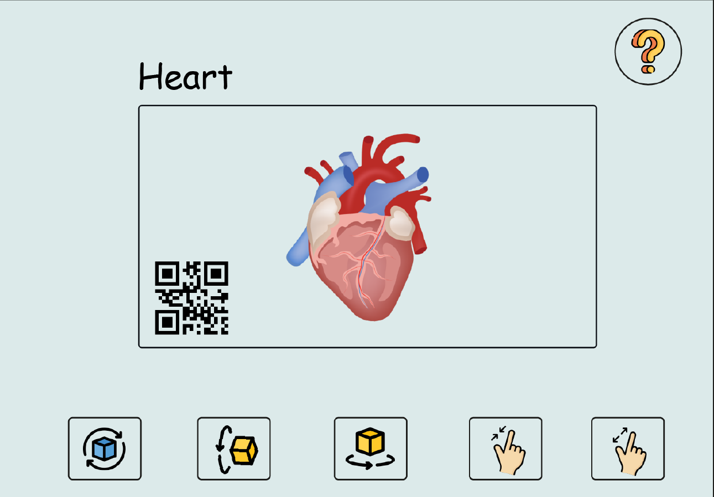
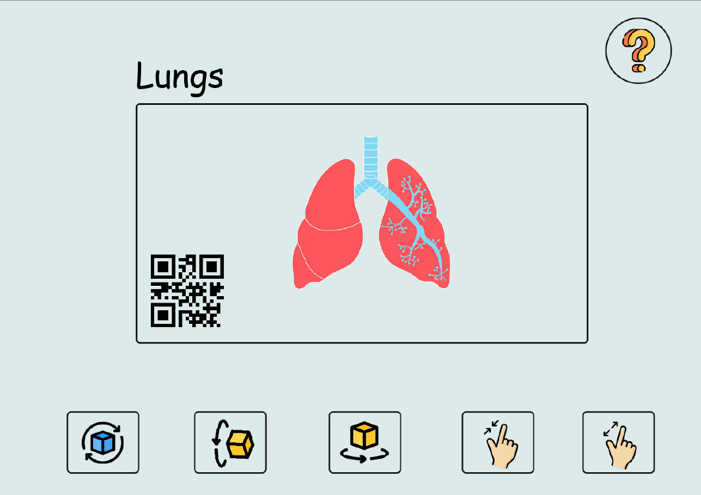
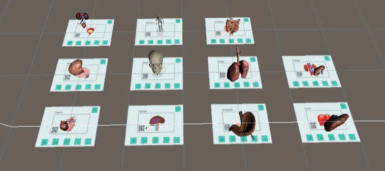
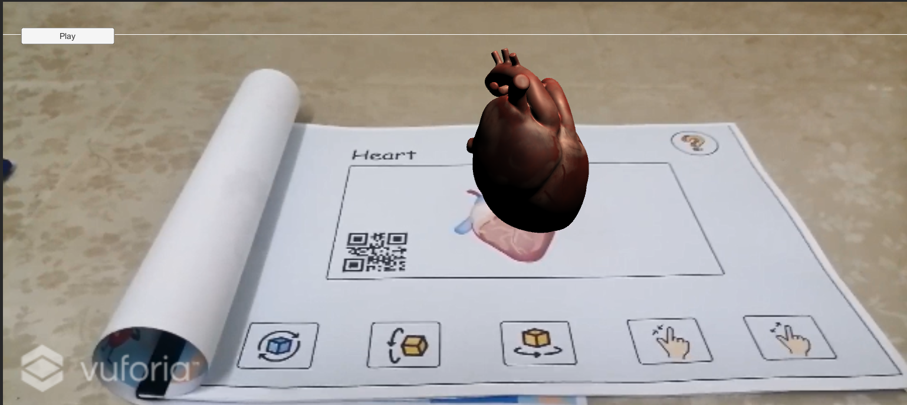

# Human Anatomy AR Learning App for Kids

## Overview

This AR application is designed as an interactive learning tool for children to explore human anatomy in a fun and engaging way. By utilizing augmented reality technology, the app brings a series of 3D organ models to life, allowing kids to learn about various organs and their functions through visual and auditory experiences.

## Features

### Interactive 3D Models

The application includes detailed 3D models of human organs such as the Kidney, Liver, Lungs, Intestines, Spleen, Stomach, Bladder, Brain, Skeleton, Human Skull, and Heart. We continually work on adding more models to enrich the learning experience.

### Audio Descriptions

Audio descriptions for each organ are provided, narrated by MrBeast (sound generated by Speechify). These descriptions enhance the learning experience by providing interesting facts and information in a clear and engaging manner.

### Play/Pause Audio Control

Users can control audio playback through a simple UI button, allowing them to play or pause the narration as needed. This feature helps accommodate the learning pace of each user.

### Augmented Reality Powered by Vuforia

The app leverages Vuforia 9.8 for image recognition, enabling it to display 3D models when the device's camera points at specific markers in the physical companion book.

## Screenshots

#### Markers Examples

#### Augmented Organs Overveiw

## Audio Example

Listen to a sample audio description here: [Audio Sample](./github_assets/audio/audio_brain.wav)

## Companion Book

Download the companion book here: [Companion Book PDF](./github_assets/pdf/Humana_Anatomy_Book.pdf)

## Technical Details

-   **Tech Stack**:
    -   **Unity Engine**: Version 2019.4.18f1
    -   **Vuforia AR**: Version 9.8
-   **Audio**: Audio descriptionsgenerated using Speechify.

## Future Enhancements

-   Add more organs and detailed models.
-   Introduce interactive quizzes to test knowledge retention.
-   Include multilingual support to reach a broader audience.
